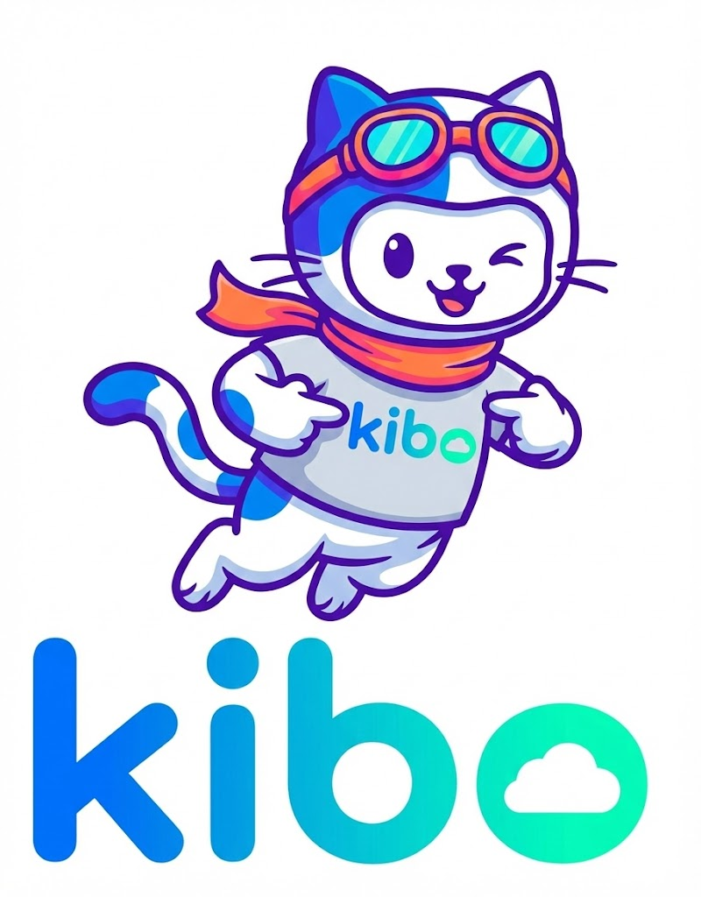

# Welcome to Kibo AI

<p align="center">
  
</p>

**The Universal Distributed Agent Framework**

**Kibo** is a powerful and flexible abstraction framework designed to unify the orchestration of AI Agents. It provides a standardized interface to define, execute, and combine agents from various underlying libraries (like **Agno**, **LangChain**, **CrewAI**, and **PydanticAI**).

Kibo is not just a wrapper; it transforms standalone agents into **distributed**, **observable**, and **interconnected** components of a larger system.

[Get Started](getting-started.md){ .md-button .md-button--primary }

---

## 🏗️ The Kibo Stack

Kibo covers the entire lifecycle of agentic applications, providing a layered architecture that handles everything from definition to distributed execution.

### **1. Orchestration Layer (The Core)**
At the heart of Kibo is the **Unified Agent Blueprint**.
*   **AgentConfig**: Define your agents using pure Python data structures. No framework-specific boilerplate is locked into your business logic.
*   **Framework Agnostic**: Switch the underlying engine (e.g., from `agno` to `langchain`) by changing a single string in the config.

### **2. Execution Layer (The Engine)**
Kibo provides a dual-runtime environment to suit your scaling needs:
*   **Local Runtime**: Optimized for low-overhead, single-machine execution using thread pools. Perfect for development and simple workflows.
*   **Distributed Runtime (Ray)**: Built on top of **Ray**, enabling massive horizontal scaling. Run agents across a cluster of machines with fault tolerance and parallel processing.

### **3. Integration Layer (The Ecosystem)**
Kibo seamlessly integrates with the best-in-class agent frameworks:
*   **Agno (formerly PhiData)**: For lightweight, specialized agents.
*   **LangChain**: For extensive tool support and complex chain logic.
*   **CrewAI**: For role-based multi-agent teams.
*   **PydanticAI**: For strictly typed, data-driven agents.
*   **LangGraph**: For stateful, graph-based workflows.

### **4. Observability Layer (The Eyes)**
Built-in support for **Langfuse** gives you full visibility into your agentic systems:
*   **Tracing**: Track every step of your agent's execution, across frameworks and distributed nodes.
*   **Monitoring**: Keep an eye on latency, costs, and error rates.
*   **Prompt Management**: Version and manage your prompts centrally.

### **5. Networking Layer (The Connective Tissue)**
Kibo introduces the **Agent-to-Agent (A2A) Protocol**:
*   **Direct Communication**: Agents can discover and message each other directly, enabling complex, emergent behaviors.
*   **Standardized Interface**: Common protocol for requests and responses, regardless of the underlying framework.

---

## 🚀 Key Features

*   **Unified Abstraction**: One interface to rule them all.
*   **Multi-Framework Interop**: Mix LangChain agents with CrewAI teams in the same workflow.
*   **Native Tool Integration**: Pass standard Python functions or library-specific tools directly.
*   **Zero-Dependency Definitions**: Your agent definitions remain clean and portable.
*   **AI Gateway**: Unified access to LLMs via LiteLLM integration.

## 📦 Quick Install

```bash
git clone https://github.com/D10S0VSkY-OSS/kiboai.git
cd kiboai
uv sync
```

[Read the Documentation](getting-started.md) to start building distributed agents today.
